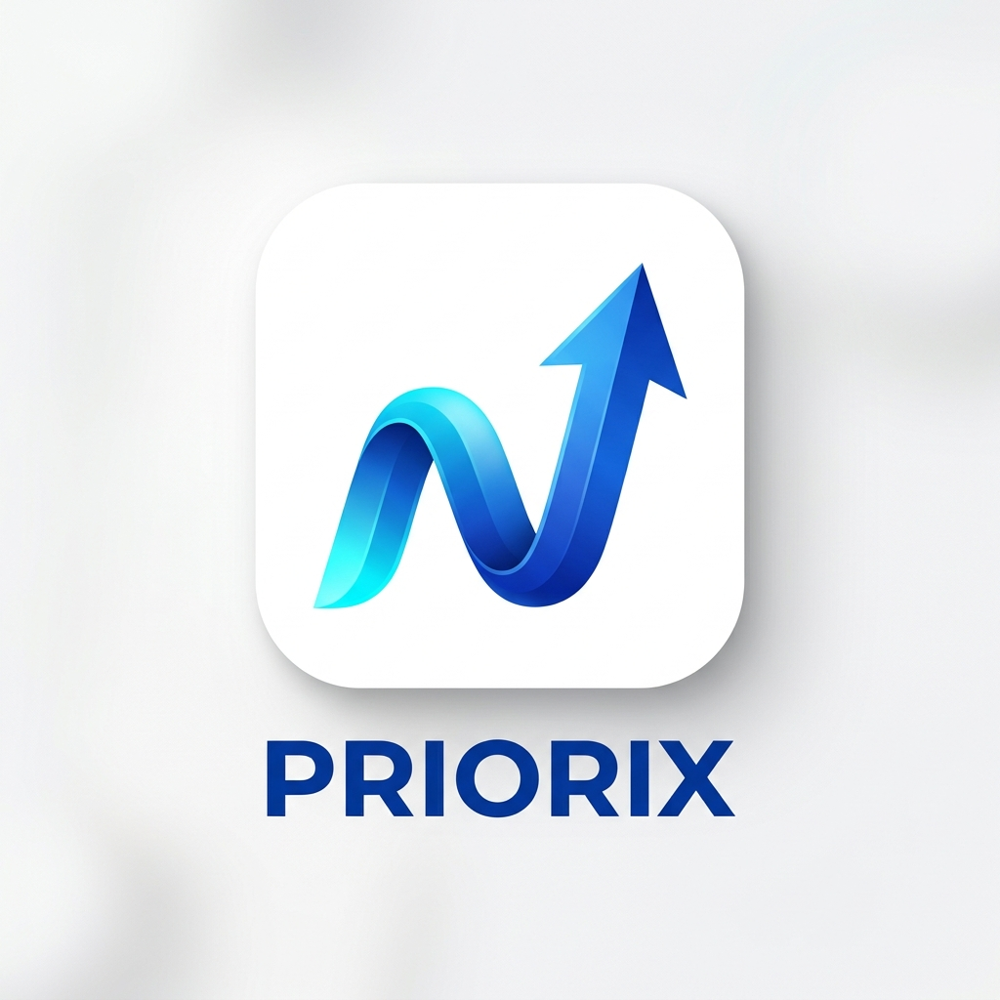

<div align="center">
  
</div>

# Priorix

A smart task prioritization and workload balancing tool built for teams that move fast.

### 🔗 [Live Demo - Play Now!](https://dist-ko538d7ei-yashygsu-6746s-projects.vercel.app/)

---

## What it is

Most project management tools end up becoming dumping grounds for tickets. We wanted to build something that actually helps teams figure out what to work on *next*. Priorix is an experimental task manager that uses a scoring engine to rank tasks based on effort, impact, and deadlines, doing the heavy lifting of sprint planning for you.

## Why we built this

During past projects, we noticed a recurring problem: developers would get stuck picking the "easiest" task rather than the most "important" one, and managers had zero visibility into who was secretly overwhelmed until deadlines were missed. We built Priorix to solve our own headaches. We wanted a tool that:
1. Tells you exactly what to do next.
2. Lets management instantly see capacity issues before burnout happens.
3. Gets out of the way (heavy emphasis on keyboard shortcuts).

## Core Features

- **Priority Engine:** We use a custom regression formula (modeled on the TS-PS13 dataset) to assign a 0-100 score to every task.
- **Focus Mode:** Hit the "Focus" button to hide the chaotic backlog. It isolates your top AI-recommended task with a massive timer so you can just put your head down and work.
- **Workload Heatbars:** On the admin side, user capacity isn't just a number—it's a colored heatbar. If an engineer is overloaded (8+ active tasks), their bar goes red, allowing the team lead to rebalance work immediately.
- **Global Command Palette:** We hate using the mouse. Press `Ctrl + K` to open a spotlight search that lets you navigate the app or find tasks instantly.
- **Team Hub:** A built-in realtime feed. When someone finishes a task, it auto-logs to the hub, keeping the team synced without annoying stand-up meetings.

## Technical Details

We prioritized speed and real-time synchronization for the stack:
- **Frontend:** React + Vite. We stuck with vanilla CSS and Tailwind for styling.
- **Backend/Database:** Firebase Realtime Database. We needed instant UI updates across different clients without writing complex WebSocket boilerplate, so Firebase was the easiest choice for a fast hackathon turnaround.
- **Auth:** Firebase Auth (Role-based access separating Admins and Employees).
- **Charts:** Chart.js for the analytics dashboard.

---

## Demo Logins

The login page has a **"Hackathon Demo Quick Login"** panel. Just click a name to auto-fill.

| Role     | Email                  | Password      |
|----------|------------------------|---------------|
| **Admin**| admin@priorix.com      | Priorix@123   |
| Employee | vikram@priorix.com     | Priorix@123   |
| Employee | rahul@priorix.com      | Priorix@123   |
| Employee | sneha@priorix.com      | Priorix@123   |
| Employee | arjun@priorix.com      | Priorix@123   |
| Employee | priya@priorix.com      | Priorix@123   |

---

## Running Locally (Optional)

> **Requirements:** Node.js v18+

```bash
git clone https://github.com/your-username/priorix.git
cd priorix
npm install
```

Create a `.env` file from the template and fill in your Firebase credentials:

```bash
cp .env.example .env
```

Then start the dev server:

```bash
npm run dev
```
